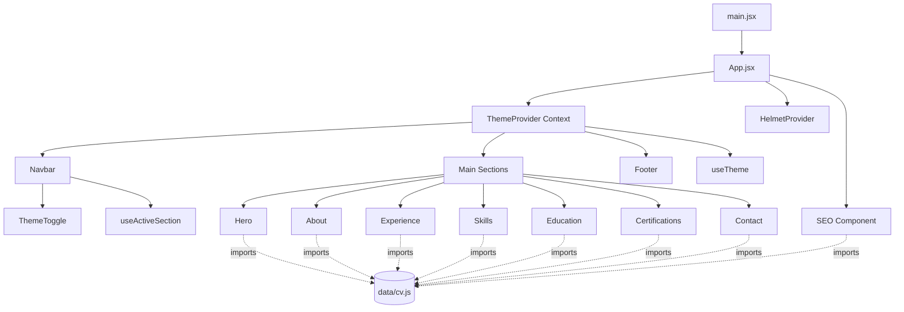

# Dokumen Desain

## Ringkasan (Overview)

Dokumen ini menjelaskan desain teknis untuk **Portfolio_Website** Suparman: sebuah aplikasi web satu-halaman (single-page application / SPA) yang menampilkan profil profesional, pengalaman kerja, keahlian, pendidikan, sertifikasi, dan kontak. Desain mengacu pada gaya visual modern, bersih, dan beranimasi halus seperti https://www.zickrian.dev/.

Tujuan desain:

- Menyajikan seluruh konten CV dalam satu halaman yang dapat digulir, dengan navigasi cepat antar bagian (Requirement 1).
- Memberikan pengalaman yang konsisten dan responsif pada seluruh kelas perangkat, dari ponsel kecil 320px hingga layar ultra-wide 1920px+ (Requirement 9).
- Mendukung mode tema terang/gelap dengan persistensi (Requirement 10).
- Teroptimasi untuk mesin pencari dan berbagi sosial (Requirement 11).
- Menampilkan animasi halus yang menghormati preferensi reduksi gerak (Requirement 12).
- Memenuhi praktik aksesibilitas dasar: navigasi keyboard, indikator fokus, label ARIA (Requirement 13).

Keputusan teknologi utama: **Vite + React.js + Tailwind CSS + Framer Motion**, dengan **react-helmet-async** untuk manajemen metadata SEO dan **JSON-LD Person** untuk data terstruktur. Konten CV dipusatkan dalam satu modul data sehingga komponen tampilan tetap deklaratif dan bebas dari data yang ditanam langsung (hardcoded).

## Arsitektur (Architecture)

### Tumpukan Teknologi (Tech Stack)

| Lapisan | Pilihan | Alasan / Pemetaan Requirement |
|---|---|---|
| Build tool | **Vite** | Dev server cepat, build produksi teroptimasi (tree-shaking, code-splitting), mendukung performa muat cepat (Requirement 12). |
| UI library | **React.js** (function components + hooks) | Diminta secara eksplisit; arsitektur berbasis komponen cocok untuk pemecahan bagian (Requirement 1–8). |
| Styling | **Tailwind CSS** | Diminta secara eksplisit; utility-first memudahkan desain responsif (Requirement 9) dan dark mode berbasis kelas (Requirement 10). |
| Animasi | **Framer Motion** | Variants deklaratif, `whileInView` untuk animasi saat masuk Viewport, dukungan `useReducedMotion` (Requirement 2, 4, 12). |
| SEO meta | **react-helmet-async** | Menyuntikkan title, meta description, Open Graph, Twitter Card, dan JSON-LD ke `<head>` (Requirement 11). |
| Ikon | **lucide-react** | Set ikon ringan dan konsisten untuk kontak, sosial, dan kontrol tema. |
| Bahasa | **JavaScript (ESM)** atau TypeScript opsional | Default JavaScript untuk kesederhanaan; struktur memungkinkan migrasi TS. |

### Pola Arsitektur

Aplikasi menggunakan arsitektur **presentational components + centralized data + custom hooks**:

- **Data layer**: satu modul `src/data/cv.js` sebagai sumber tunggal kebenaran (single source of truth) untuk seluruh konten CV.
- **Presentation layer**: komponen section murni yang menerima data via props/import dan merender markup semantik.
- **Behavior layer (hooks)**: logika lintas-komponen yang dapat diuji secara terpisah — deteksi bagian aktif (`useActiveSection`), tema (`useTheme`), dan preferensi gerak (Framer Motion `useReducedMotion`).
- **Cross-cutting**: `SEO` (Helmet), `ThemeProvider` (Context), dan utilitas murni di `src/lib/`.

Pemisahan ini memungkinkan logika non-UI (urutan kronologis, pengelompokan skill, persistensi tema, deteksi bagian aktif) diisolasi sebagai fungsi murni yang dapat diuji dengan property-based testing.



### Struktur Proyek

```
developer-portfolio-website/
├── index.html                  # Root HTML, lang="id", meta viewport, mount point
├── package.json
├── vite.config.js
├── tailwind.config.js          # darkMode: 'class', breakpoints, fluid type tokens
├── postcss.config.js
├── public/
│   ├── favicon.svg
│   ├── og-image.png            # Gambar pratinjau Open Graph (1200x630)
│   └── robots.txt
└── src/
    ├── main.jsx                # Entry: HelmetProvider + ThemeProvider + App
    ├── App.jsx                 # Komposisi layout & section
    ├── index.css               # Tailwind directives + base styles + smooth scroll
    ├── data/
    │   └── cv.js               # Sumber tunggal konten CV
    ├── lib/
    │   ├── theme.js            # getInitialTheme, applyTheme, persistTheme
    │   ├── sections.js         # daftar metadata section + getActiveSection
    │   ├── ordering.js         # sortExperiencesByRecency
    │   └── skills.js           # groupSkillsByCategory
    ├── hooks/
    │   ├── useTheme.js
    │   └── useActiveSection.js
    ├── components/
    │   ├── Navbar.jsx
    │   ├── ThemeToggle.jsx
    │   ├── SEO.jsx
    │   ├── Section.jsx         # wrapper animasi + semantic <section>
    │   ├── AnimatedItem.jsx    # wrapper Framer Motion menghormati reduced-motion
    │   └── Footer.jsx
    └── sections/
        ├── Hero.jsx
        ├── About.jsx
        ├── Experience.jsx
        ├── Skills.jsx
        ├── Education.jsx
        ├── Certifications.jsx
        └── Contact.jsx
```

## Komponen dan Antarmuka (Components and Interfaces)

### Navbar (`components/Navbar.jsx`)

Memenuhi Requirement 1.

- Menampilkan tautan ke seluruh tujuh bagian (Hero, About, Experience, Skills, Education, Certification, Contact) — Req 1.1.
- Posisi `sticky top-0` dengan `z-index` tinggi agar tetap terlihat saat menggulir — Req 1.3.
- Setiap tautan menggunakan anchor `href="#id"` sehingga gulir halus ditangani oleh CSS `scroll-behavior: smooth` pada elemen root (dengan penanganan offset sticky) — Req 1.2.
- Menerima `activeId` dari hook `useActiveSection` dan menerapkan styling aktif + `aria-current="true"` pada tautan terkait — Req 1.4.
- Pada Viewport `< 768px`, menampilkan tombol hamburger dengan state `isOpen`; panel menu dapat dibuka/ditutup, tombol memiliki `aria-expanded` dan `aria-controls` — Req 1.5.
- Memuat `ThemeToggle`.

Antarmuka:

```js
// props
{ activeId: string }     // id bagian yang sedang aktif
```

### ThemeToggle (`components/ThemeToggle.jsx`)

Memenuhi Requirement 10.

- Membaca `theme` dan `toggleTheme` dari context `useTheme`.
- Menampilkan ikon matahari/bulan; memiliki `aria-label` ("Beralih ke mode gelap/terang") karena tidak ada teks terlihat — Req 13.3.
- Ukuran area sentuh minimal 44×44px — Req 9.3.

### SEO (`components/SEO.jsx`)

Memenuhi Requirement 11.

- Menggunakan `<Helmet>` dari react-helmet-async.
- Menyuntikkan: `<title>`, `<meta name="description">` (Req 11.1); Open Graph (`og:title`, `og:description`, `og:type`, `og:image`, `og:url`) dan Twitter Card (`twitter:card`, `twitter:title`, `twitter:description`, `twitter:image`) (Req 11.2); skrip `<script type="application/ld+json">` berisi objek `Person` (Req 11.3).
- Membangun JSON-LD melalui fungsi murni `buildPersonJsonLd(profile, contact)` agar dapat diuji.

Antarmuka:

```js
// props (default dari data/cv.js)
{ profile: Profile, contact: Contact, ogImage: string, siteUrl: string }
```

### Section (`components/Section.jsx`)

Wrapper umum untuk setiap bagian: merender `<section id aria-labelledby>` semantik dengan heading bagian, serta membungkus konten dengan animasi `whileInView`. Memastikan hanya Hero yang memuat `<h1>`; bagian lain menggunakan `<h2>` — Req 11.4.

### AnimatedItem (`components/AnimatedItem.jsx`)

Wrapper `motion.*` yang membaca `useReducedMotion()`. Jika reduksi gerak aktif, animasi dinonaktifkan (varian langsung ke state akhir) — Req 12.2. Durasi default berada dalam rentang 200–800ms — Req 12.1.

### Section Components (`sections/*.jsx`)

| Komponen | Requirement | Ringkasan |
|---|---|---|
| `Hero` | 2 | Nama "Suparman", peran Web Developer, CTA ke Contact & Experience; animasi masuk ≤ 1000ms (Req 2.3). Memuat satu-satunya `<h1>`. |
| `About` | 3 | Ringkasan profil (S1 TI, sertifikasi, alumni DBS Coding Camp) + lokasi "Jakarta Selatan, DKI Jakarta". |
| `Experience` | 4 | Render tiga pengalaman dari data, terurut terbaru→terlama via `sortExperiencesByRecency`; tiap kartu menampilkan jabatan, perusahaan, periode, daftar tanggung jawab; animasi saat masuk Viewport. |
| `Skills` | 5 | Render kategori dari `groupSkillsByCategory`; tiap item di bawah kategori yang sesuai. |
| `Education` | 6 | Dua riwayat pendidikan: institusi, program studi, periode. |
| `Certifications` | 7 | Enam item: nama, lembaga, tahun. |
| `Contact` | 8 | Email `mailto:` dan telepon `tel:`; ikon sosial dengan `aria-label`. |

### Footer (`components/Footer.jsx`)

Menampilkan nama, tahun, dan tautan cepat. Bukan bagian utama navigasi.

### Hooks

```js
// hooks/useTheme.js
useTheme(): { theme: 'light' | 'dark', toggleTheme: () => void, setTheme: (t) => void }

// hooks/useActiveSection.js
useActiveSection(sectionIds: string[]): string   // mengembalikan id bagian aktif
```

### Utilitas Murni (`lib/`)

```js
// lib/theme.js
getInitialTheme(stored: string | null, prefersDark: boolean): 'light' | 'dark'
persistTheme(theme): void          // menulis ke localStorage
readTheme(): string | null         // membaca dari localStorage

// lib/ordering.js
sortExperiencesByRecency(experiences: Experience[]): Experience[]

// lib/skills.js
groupSkillsByCategory(skills: Skill[], categoryOrder: string[]): SkillGroup[]

// lib/sections.js
getActiveSection(positions: {id, top}[], scrollY: number, offset: number): string

// lib/seo.js
buildPersonJsonLd(profile: Profile, contact: Contact): object
```

## Model Data (Data Models)

Seluruh konten CV dipusatkan di `src/data/cv.js`. Ini menjaga komponen tetap deklaratif dan memenuhi Requirement 2–8 secara data-driven.

```js
// Tipe konseptual (didokumentasikan via JSDoc di JS)

/** @typedef {Object} Profile
 *  @property {string} name              // "Suparman"
 *  @property {string} role              // "Junior Web Developer & Analis Program"
 *  @property {string} headline          // ringkasan singkat untuk Hero
 *  @property {string} summary           // ringkasan profil About (Req 3.1)
 *  @property {string} location          // "Jakarta Selatan, DKI Jakarta" (Req 3.2)
 */

/** @typedef {Object} Experience
 *  @property {string} id
 *  @property {string} title             // jabatan (Req 4.2)
 *  @property {string} company           // nama perusahaan (Req 4.2)
 *  @property {string} startDate         // ISO "YYYY-MM" untuk pengurutan (Req 4.4)
 *  @property {string|null} endDate      // null = sekarang/present
 *  @property {string} period            // label tampilan, mis. "2024 - Sekarang"
 *  @property {string[]} responsibilities// daftar tanggung jawab (Req 4.3)
 */

/** @typedef {Object} Skill
 *  @property {string} name
 *  @property {string} category          // harus salah satu dari SKILL_CATEGORIES
 */

/** @typedef {Object} SkillGroup
 *  @property {string} category
 *  @property {Skill[]} items
 */

/** @typedef {Object} Education
 *  @property {string} institution       // (Req 6.2)
 *  @property {string} program           // program studi (Req 6.2)
 *  @property {string} period            // (Req 6.2)
 *  @property {string} startDate         // untuk pengurutan
 */

/** @typedef {Object} Certification
 *  @property {string} name              // (Req 7.2)
 *  @property {string} issuer            // lembaga penerbit (Req 7.2)
 *  @property {string} year              // tahun (Req 7.2)
 */

/** @typedef {Object} Contact
 *  @property {string} email             // "suparman0921@gmail.com" (Req 8.1)
 *  @property {string} phone             // "+62 857 9752 2591" (Req 8.1)
 *  @property {string} phoneHref         // "+6285797522591" untuk tel: (Req 8.3)
 *  @property {SocialLink[]} socials
 */

export const SKILL_CATEGORIES = [
  'Software Engineering',
  'Mobile Development',
  'Finance & Taxation',
  'Tax Compliance',
  'Corporate Administration',
  'Productivity & Creative',
  'Hardware & Systems',
];

export const profile = { /* ... */ };
export const experiences = [ /* 3 item */ ];   // Req 4.1
export const skills = [ /* item dengan category dari SKILL_CATEGORIES */ ];  // Req 5
export const education = [ /* 2 item */ ];      // Req 6.1
export const certifications = [ /* 6 item */ ]; // Req 7.1
export const contact = { /* ... */ };           // Req 8.1
```

Catatan desain:

- `startDate`/`endDate` dalam format `YYYY-MM` yang dapat diurutkan secara leksikografis, sehingga `sortExperiencesByRecency` deterministik tanpa parsing tanggal yang rapuh.
- `phoneHref` dipisahkan dari `phone` agar tampilan tetap manusiawi sementara `tel:` valid (Req 8.3).
- Field `category` pada `Skill` divalidasi terhadap `SKILL_CATEGORIES` saat pengelompokan; kategori kosong tetap muncul sesuai urutan kanonik agar tata letak stabil.

## Sistem Tema (Theme System)

Memenuhi Requirement 10.

- **Tailwind dark mode berbasis kelas**: `darkMode: 'class'` di `tailwind.config.js`. Toggle menambah/menghapus kelas `dark` pada `<html>`.
- **Inisialisasi**: `getInitialTheme(stored, prefersDark)` — jika ada nilai tersimpan di localStorage gunakan itu (Req 10.3); jika tidak, gunakan `prefers-color-scheme` sebagai default; fallback ke `light`.
- **Anti flash of incorrect theme**: skrip inline kecil di `index.html` menerapkan kelas tema sebelum React mount.
- **Persistensi**: `ThemeProvider` menulis ke `localStorage` (`persistTheme`) setiap kali tema berubah (Req 10.3) dan menyinkronkan kelas `dark` pada `<html>` (Req 10.2).
- **Context**: `ThemeProvider` mengekspos `{ theme, toggleTheme, setTheme }` melalui React Context yang dikonsumsi `ThemeToggle` dan komponen lain.

## Strategi Desain Responsif (Responsive Design Strategy)

Memenuhi Requirement 9.

Breakpoint Tailwind kustom dipetakan langsung ke kelas perangkat pada Req 9.1:

```js
// tailwind.config.js -> theme.screens
{
  'xs':  '375px',   // ponsel besar
  'md':  '768px',   // tablet
  'lg':  '1024px',  // laptop
  'xl':  '1440px',  // desktop besar
  '2xl': '1920px',  // ultra-wide
}
// Dasar (mobile-first) menargetkan ponsel kecil 320–374px tanpa prefix.
```

Strategi:

- **Mobile-first & fluid**: tata letak default untuk 320px; kelas breakpoint menaikkan kolom/spacing secara progresif (Req 9.1).
- **Tanpa overflow horizontal**: kontainer menggunakan `max-w-*` + `px-*`, `overflow-x-hidden` pada root, gambar `max-w-full`, grid yang membungkus (`flex-wrap`/`grid` responsif) (Req 9.2, 9.6).
- **Touch target ≥ 44×44px**: tombol/tautan interaktif memakai utilitas `min-h-11 min-w-11` (44px) dan padding memadai (Req 9.3).
- **Responsive media**: setiap `` memakai `max-w-full h-auto object-contain` untuk mempertahankan rasio aspek tanpa terpotong (Req 9.4).
- **Fluid typography**: teks isi menggunakan `clamp(1rem, …, 1.25rem)` (16–20px) via token Tailwind kustom `text-body` sehingga tetap dalam rentang pada semua Viewport ≥ 320px (Req 9.5).
- **Orientasi**: karena layout berbasis aliran (flow) dan fluid, perubahan portrait↔landscape ditangani oleh aturan responsif yang sama tanpa gulir horizontal (Req 9.6).

## Strategi Animasi (Animation Strategy)

Memenuhi Requirement 2, 4, 12.

- **Framer Motion variants** terpusat di `lib/motion.js` (mis. `fadeUp`, `staggerContainer`).
- **Scroll-triggered**: bagian dan kartu memakai `whileInView` + `viewport={{ once: true, amount: 0.2 }}` sehingga animasi masuk berjalan saat elemen memasuki Viewport (Req 4.5, 12.1).
- **Durasi**: animasi masuk bagian/kartu menggunakan durasi 200–800ms (Req 12.1); animasi masuk Hero diatur agar total ≤ 1000ms termasuk stagger (Req 2.3).
- **prefers-reduced-motion**: `useReducedMotion()` dari Framer Motion; ketika aktif, `AnimatedItem` melewati transisi gerak dan langsung menampilkan state akhir (opacity penuh, tanpa translate) (Req 12.2).
- **Performa**: animasi hanya pada properti `transform`/`opacity` yang murah secara komposit; tidak menganimasi properti layout.

## Strategi SEO (SEO Strategy)

Memenuhi Requirement 11.

- **Title & meta description** deskriptif berisi nama dan peran Suparman (Req 11.1).
- **Open Graph & Twitter Card** untuk pratinjau sosial, termasuk `og:image`/`twitter:image` menunjuk `public/og-image.png` 1200×630 (Req 11.2).
- **JSON-LD `Person`** dibangun oleh `buildPersonJsonLd` berisi `name`, `jobTitle`, `email`, `telephone`, `address`, dan `sameAs` (sosial) (Req 11.3).
- **Heading semantik**: tepat satu `<h1>` (di Hero); seluruh bagian lain memakai `<h2>` lalu `<h3>` untuk sub-item — dijaga oleh komponen `Section` (Req 11.4).
- **Alt text**: setiap `` wajib memiliki atribut `alt` deskriptif; gambar dekoratif memakai `alt=""` (Req 11.5).
- **HTML lang**: `index.html` menetapkan `lang="id"`.

## Strategi Aksesibilitas (Accessibility Strategy)

Memenuhi Requirement 13.

- **Navigasi keyboard**: seluruh elemen interaktif adalah elemen native (`<a>`, `<button>`) yang fokusable secara default; urutan DOM logis; menu hamburger dapat dioperasikan dengan Enter/Space dan ditutup dengan Escape (Req 13.1).
- **Indikator fokus terlihat**: utilitas `focus-visible:ring-2 focus-visible:ring-offset-2` pada semua elemen interaktif; tidak menghapus outline tanpa pengganti (Req 13.2).
- **aria-label**: kontrol tanpa teks terlihat (ThemeToggle, tombol hamburger, ikon sosial) memiliki `aria-label`; tautan aktif memakai `aria-current` (Req 13.3).
- **Smooth scroll + active section**: gulir halus via CSS; bagian aktif dideteksi oleh `useActiveSection` yang menghitung posisi relatif terhadap ambang offset sticky navbar, lalu menandai tautan (Req 1.4).
- **Skip-to-content** opsional: tautan lewati-ke-konten untuk pengguna keyboard.

## Correctness Properties

*Sebuah properti adalah karakteristik atau perilaku yang harus selalu benar di seluruh eksekusi sistem yang valid — pada dasarnya pernyataan formal tentang apa yang seharusnya dilakukan sistem. Properti menjadi jembatan antara spesifikasi yang dapat dibaca manusia dan jaminan kebenaran yang dapat diverifikasi mesin.*

Sebagian besar bagian aplikasi ini adalah rendering UI, layout responsif (CSS), dan konten statis, yang lebih tepat diuji dengan example/snapshot test. Properti di bawah berfokus pada **fungsi murni** yang memiliki perilaku input/output yang bervariasi secara bermakna: pengurutan, pengelompokan, logika tema, deteksi bagian aktif, normalisasi kontak, pembentukan JSON-LD, dan logika reduksi gerak.

### Property 1: Pemilihan bagian aktif selalu valid

*Untuk setiap* daftar posisi bagian (id, top) yang tidak kosong dan nilai scrollY apa pun, `getActiveSection` SHALL mengembalikan tepat satu id yang ada dalam daftar, yaitu bagian terakhir yang `top`-nya kurang dari atau sama dengan `scrollY + offset` (atau bagian pertama jika belum ada yang terlewati).

**Validates: Requirements 1.4**

### Property 2: Kelengkapan render item daftar

*Untuk setiap* koleksi item data (experiences atau certifications) dengan field wajib apa pun, komponen daftar yang dirender SHALL menampilkan seluruh field wajib setiap item (mis. jabatan, perusahaan, periode, dan setiap tanggung jawab untuk experience; nama, lembaga, tahun untuk certification) tanpa ada yang hilang.

**Validates: Requirements 4.1, 4.2, 4.3, 7.1, 7.2**

### Property 3: Pengurutan pengalaman kerja

*Untuk setiap* daftar pengalaman kerja, `sortExperiencesByRecency` SHALL menghasilkan daftar yang terurut secara monoton dari `startDate` terbaru ke terlama dan merupakan permutasi dari daftar masukan (tidak ada item yang hilang, bertambah, atau berubah).

**Validates: Requirements 4.4**

### Property 4: Pengelompokan keahlian mempartisi tanpa kehilangan

*Untuk setiap* daftar keahlian yang kategorinya berasal dari `SKILL_CATEGORIES`, `groupSkillsByCategory` SHALL menempatkan setiap keahlian tepat di bawah grup kategorinya, gabungan seluruh grup merupakan permutasi dari daftar masukan (tanpa kehilangan/duplikasi), dan urutan grup mengikuti urutan kanonik `SKILL_CATEGORIES`.

**Validates: Requirements 5.1, 5.2**

### Property 5: Normalisasi nomor telepon untuk tautan tel

*Untuk setiap* string nomor telepon, nilai href `tel:` yang dihasilkan SHALL diawali dengan `tel:` dan bagian nomornya hanya mengandung karakter `+` dan digit (`0-9`), mempertahankan urutan digit asli.

**Validates: Requirements 8.3**

### Property 6: Pergantian tema adalah involusi

*Untuk setiap* tema awal (`light` atau `dark`), memanggil `toggleTheme` dua kali berturut-turut SHALL mengembalikan tema ke nilai semula.

**Validates: Requirements 10.1, 10.2**

### Property 7: Persistensi tema round-trip

*Untuk setiap* tema yang valid, memanggil `persistTheme(theme)` lalu `getInitialTheme(readTheme(), prefersDark)` SHALL mengembalikan tema yang sama terlepas dari nilai `prefersDark`.

**Validates: Requirements 10.3**

### Property 8: JSON-LD Person mencerminkan input dan valid round-trip

*Untuk setiap* objek profile dan contact yang valid, `buildPersonJsonLd` SHALL menghasilkan objek dengan `@type` bernilai `"Person"` yang field-nya (name, jobTitle, email, telephone) mencerminkan nilai input, dan objek tersebut SHALL bertahan melalui round-trip `JSON.parse(JSON.stringify(obj))` tanpa kehilangan data.

**Validates: Requirements 11.3**

### Property 9: Reduksi gerak menetralkan animasi

*Untuk setiap* varian animasi, ketika `prefersReducedMotion` bernilai true, props gerak yang dihasilkan `getMotionProps` SHALL membuat state awal (`initial`) sama dengan state akhir (`animate`) sehingga tidak ada perpindahan posisi/translasi gerak.

**Validates: Requirements 12.2**

## Penanganan Kesalahan (Error Handling)

Aplikasi bersifat statis dan client-side, sehingga ruang kesalahan terbatas. Strategi:

- **Data hilang/opsional**: komponen merender field secara defensif. Field opsional (mis. `endDate = null` berarti "Sekarang") ditangani di lapisan tampilan; daftar kosong merender state kosong yang aman, bukan crash.
- **localStorage tidak tersedia** (mode privat/diblokir): `readTheme`/`persistTheme` dibungkus `try/catch`; jika gagal, aplikasi fallback ke `getInitialTheme` berbasis `prefers-color-scheme` tanpa melempar error (Req 10.3).
- **Kategori skill tidak dikenal**: `groupSkillsByCategory` mengabaikan/meletakkan item dengan kategori di luar `SKILL_CATEGORIES` secara aman (mis. grup "Lainnya" atau dilewati) agar tata letak tidak rusak.
- **Tanggal tidak valid** pada pengurutan: `sortExperiencesByRecency` memperlakukan `startDate` yang tidak terparse sebagai paling lama agar pengurutan tetap total dan deterministik.
- **Error Boundary React**: `App` dibungkus error boundary tingkat atas yang menampilkan pesan ramah alih-alih layar kosong jika terjadi error render tak terduga.
- **Gambar gagal dimuat**: atribut `alt` tetap memberi konteks; tata letak tidak bergeser karena dimensi/aspect-ratio dipertahankan (Req 9.4, 11.5).

## Strategi Pengujian (Testing Strategy)

Pendekatan ganda: **property-based test** untuk fungsi murni dengan properti universal, dan **example/unit + integration test** untuk rendering, interaksi, dan layout.

### Alat

- **Vitest** sebagai test runner (integrasi natif dengan Vite).
- **@testing-library/react** + **@testing-library/jest-dom** untuk render dan asersi DOM/aksesibilitas.
- **fast-check** sebagai pustaka property-based testing untuk JavaScript. Properti TIDAK diimplementasikan dari nol.

### Property-Based Tests

- Setiap properti pada bagian Correctness Properties diimplementasikan dengan **satu** property-based test.
- Setiap test dikonfigurasi minimum **100 iterasi** (`fc.assert(..., { numRuns: 100 })`).
- Setiap test diberi tag komentar dengan format: **Feature: developer-portfolio-website, Property {number}: {property_text}**.
- Cakupan: Property 1 (getActiveSection), 2 (kelengkapan render via generator data + Testing Library), 3 (sortExperiencesByRecency), 4 (groupSkillsByCategory), 5 (normalisasi tel), 6 (toggle involution), 7 (persist round-trip dengan mock localStorage), 8 (buildPersonJsonLd + JSON round-trip), 9 (getMotionProps reduced-motion).
- Generator kustom: `experienceArb`, `skillArb` (kategori dari `SKILL_CATEGORIES`), `phoneStringArb` (termasuk karakter non-digit seperti spasi, tanda hubung, kurung), `profileArb`/`contactArb`, dan `sectionPositionsArb`.

### Unit / Example Tests

Fokus pada contoh spesifik, edge case, dan titik integrasi (hindari berlebihan karena PBT menangani cakupan luas):

- **Hero** (Req 2): menampilkan "Suparman", peran, dua CTA; total durasi animasi masuk ≤ 1000ms.
- **About** (Req 3): memuat ringkasan S1 TI/sertifikasi/DBS dan lokasi "Jakarta Selatan, DKI Jakarta".
- **Navbar** (Req 1): tujuh tautan ada; klik mengarah ke anchor yang benar; hamburger toggle membuka/menutup dengan `aria-expanded`; sticky.
- **Contact** (Req 8): href `mailto:suparman0921@gmail.com` dan `tel:+6285797522591`.
- **SEO** (Req 11.1, 11.2): Helmet menyuntik title, meta description, OG, dan Twitter Card.
- **ThemeToggle** (Req 10): klik mengubah kelas `dark` pada `<html>`.

### Integration / Structural Tests

- **Satu h1** (Req 11.4): render `App`, pastikan jumlah `<h1>` tepat 1.
- **Alt text** (Req 11.5): render `App`, pastikan setiap `` memiliki atribut `alt`.
- **Accessible name** (Req 13.3): tombol ikon-only (ThemeToggle, hamburger, sosial) memiliki accessible name/`aria-label`.
- **Fokus terlihat** (Req 13.2): elemen interaktif memiliki utilitas `focus-visible`.
- **Tanpa overflow horizontal** (Req 9.2, 9.6): render pada beberapa lebar Viewport representatif (320, 768, 1440, 1920) dan orientasi, pastikan tidak ada overflow horizontal (1–3 contoh per kasus).
- **Touch target** (Req 9.3): elemen interaktif memiliki kelas ukuran minimum 44px.

### Catatan PBT (Mengapa terbatas)

Layout responsif, animasi visual, dan konten statis tidak memiliki properti "untuk semua input" yang bermakna, sehingga diuji dengan example/snapshot/integration test. Property-based testing diterapkan hanya pada lapisan logika murni tempat variasi input mengungkap edge case (pengurutan, pengelompokan, tema, deteksi bagian, normalisasi, JSON-LD, reduksi gerak).
