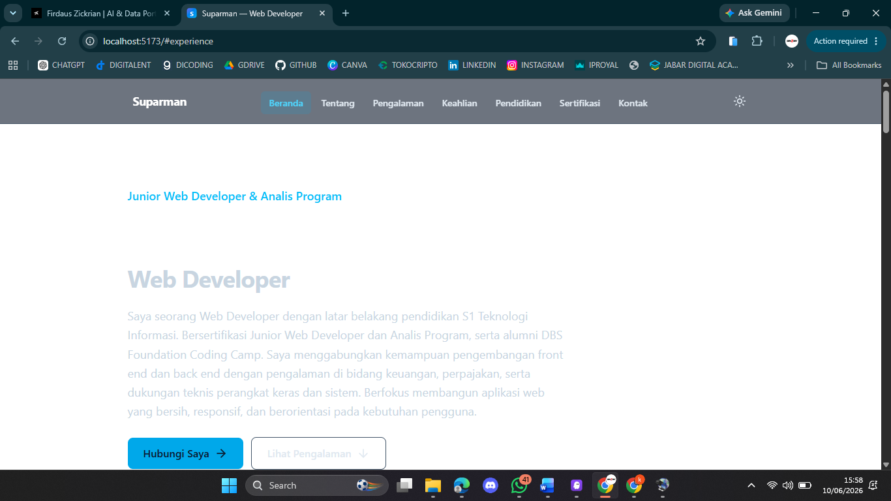

# Rencana Implementasi: Developer Portfolio Website

## Ringkasan

Rencana ini memecah desain menjadi langkah-langkah pengkodean inkremental dan berbasis pengujian. Setiap tugas dibangun di atas tugas sebelumnya: dimulai dari scaffold proyek dan tooling, lalu lapisan data terpusat, fungsi murni (`lib/`) beserta property-based test untuk 9 correctness properties, hooks dan ThemeProvider, komponen tampilan (shared + section), hingga perakitan akhir (App, SEO, responsif, aksesibilitas). Tidak ada kode menggantung — setiap bagian dirangkai ke dalam `App` pada langkah-langkah berikutnya.

Stack: Vite + React.js + Tailwind CSS + Framer Motion + react-helmet-async + lucide-react. Pengujian: Vitest + @testing-library/react + @testing-library/jest-dom + fast-check.

Catatan:

- Sub-tugas yang ditandai `*` bersifat opsional (pengujian) dan dapat dilewati untuk MVP yang lebih cepat.
- Setiap tugas merujuk klausa requirement tertentu untuk keterlacakan.
- Property-based test mengacu pada properti di bagian Correctness Properties pada `design.md`, dikonfigurasi minimum 100 iterasi (`fc.assert(..., { numRuns: 100 })`) dan diberi tag komentar `Feature: developer-portfolio-website, Property {n}: ...`.

## Tasks

- [x] 1. Siapkan scaffold proyek dan tooling
  - Inisialisasi proyek Vite + React (JavaScript/ESM); buat `index.html` dengan `lang="id"`, meta viewport, dan mount point `#root`
  - Pasang dependensi: `tailwindcss`, `postcss`, `autoprefixer`, `framer-motion`, `react-helmet-async`, `lucide-react`
  - Konfigurasi Tailwind: `tailwind.config.js` dengan `darkMode: 'class'`, breakpoints kustom (`xs` 375, `md` 768, `lg` 1024, `xl` 1440, `2xl` 1920), dan token tipografi fluid (`text-body` clamp 16–20px); buat `postcss.config.js`
  - Buat `src/index.css` dengan direktif Tailwind, base styles, dan `scroll-behavior: smooth`
  - Pasang dan konfigurasi tooling pengujian: `vitest`, `@testing-library/react`, `@testing-library/jest-dom`, `fast-check`, `jsdom`; tambahkan konfigurasi test (environment jsdom + setup jest-dom) ke `vite.config.js` dan skrip `test` di `package.json`
  - Buat struktur direktori `src/data`, `src/lib`, `src/hooks`, `src/components`, `src/sections`
  - _Requirements: 9.1, 10.2, 12.1_

- [x] 2. Implementasikan modul data CV terpusat
  - [x] 2.1 Buat `src/data/cv.js` sebagai sumber tunggal kebenaran
    - Definisikan JSDoc typedef (Profile, Experience, Skill, SkillGroup, Education, Certification, Contact) dan ekspor konstanta `SKILL_CATEGORIES` sesuai urutan kanonik
    - Isi `profile` (nama "Suparman", peran Web Developer, headline, summary mencakup S1 Teknologi Informasi, sertifikasi Junior Web Developer & Analis Program, alumni DBS Foundation Coding Camp, lokasi "Jakarta Selatan, DKI Jakarta")
    - Isi `experiences` (3 item: Back End & Front End Developer / Dicoding x DBS Foundation, Staff Finance & IT Support / PT. Magati Unggul, Hardware & System Engineer / CV. Salafindo) dengan `startDate`/`endDate` format `YYYY-MM`, `period`, dan `responsibilities`
    - Isi `skills` (kategori dari `SKILL_CATEGORIES`), `education` (2 item: Universitas Bina Sarana Informatika, SMK Pembangunan Cibadak), `certifications` (6 item: nama, issuer, year)
    - Isi `contact` (email "suparman0921@gmail.com", phone "+62 857 9752 2591", `phoneHref` "+6285797522591", `socials`)
    - _Requirements: 2.1, 3.1, 3.2, 4.1, 5.1, 6.1, 7.1, 8.1_

  - [x] 2.2 Tulis unit test validasi integritas data CV
    - Verifikasi jumlah item (3 experiences, 2 education, 6 certifications) dan bahwa setiap `skill.category` termasuk dalam `SKILL_CATEGORIES`
    - _Requirements: 4.1, 5.1, 6.1, 7.1_

- [x] 3. Implementasikan fungsi murni `lib/` beserta property-based test
  - [x] 3.1 Implementasikan `src/lib/ordering.js` — `sortExperiencesByRecency`
    - Urutkan secara monoton dari `startDate` terbaru ke terlama; perlakukan `startDate` tak terparse sebagai paling lama; jangan mengubah daftar masukan
    - _Requirements: 4.4_

  - [x] 3.2 Tulis property test untuk pengurutan pengalaman
    - **Property 3: Pengurutan pengalaman kerja** (monoton terbaru→terlama dan permutasi dari masukan)
    - **Validates: Requirements 4.4**

  - [x] 3.3 Implementasikan `src/lib/skills.js` — `groupSkillsByCategory(skills, categoryOrder)`
    - Kelompokkan tiap skill ke grup kategorinya, urutan grup mengikuti `SKILL_CATEGORIES`; tangani kategori tak dikenal secara aman tanpa merusak tata letak
    - _Requirements: 5.1, 5.2_

  - [x] 3.4 Tulis property test untuk pengelompokan keahlian
    - **Property 4: Pengelompokan keahlian mempartisi tanpa kehilangan** (gabungan grup = permutasi masukan; urutan grup kanonik)
    - **Validates: Requirements 5.1, 5.2**

  - [x] 3.5 Implementasikan `src/lib/sections.js` — metadata section + `getActiveSection(positions, scrollY, offset)`
    - Kembalikan tepat satu id valid: bagian terakhir yang `top <= scrollY + offset`, atau bagian pertama jika belum ada yang terlewati
    - _Requirements: 1.4_

  - [x] 3.6 Tulis property test untuk deteksi bagian aktif
    - **Property 1: Pemilihan bagian aktif selalu valid** (mengembalikan tepat satu id yang ada dalam daftar)
    - **Validates: Requirements 1.4**

  - [x] 3.7 Implementasikan `src/lib/theme.js` — `getInitialTheme`, `readTheme`, `persistTheme`, dan helper `toggle`
    - `getInitialTheme(stored, prefersDark)`: utamakan nilai tersimpan, lalu `prefersDark`, fallback `light`; bungkus akses localStorage dengan `try/catch`
    - _Requirements: 10.1, 10.2, 10.3_

  - [x] 3.8 Tulis property test untuk involusi toggle tema
    - **Property 6: Pergantian tema adalah involusi** (dua kali toggle kembali ke nilai semula)
    - **Validates: Requirements 10.1, 10.2**

  - [x] 3.9 Tulis property test untuk persistensi tema round-trip
    - **Property 7: Persistensi tema round-trip** (`persistTheme` lalu `getInitialTheme(readTheme(), prefersDark)` mengembalikan tema sama, dengan mock localStorage)
    - **Validates: Requirements 10.3**

  - [x] 3.10 Implementasikan `src/lib/contact.js` — `buildTelHref(phone)`
    - Kembalikan string berawalan `tel:` dengan bagian nomor hanya `+` dan digit, mempertahankan urutan digit asli
    - _Requirements: 8.3_

  - [x] 3.11 Tulis property test untuk normalisasi nomor telepon
    - **Property 5: Normalisasi nomor telepon untuk tautan tel**
    - **Validates: Requirements 8.3**

  - [x] 3.12 Implementasikan `src/lib/seo.js` — `buildPersonJsonLd(profile, contact)`
    - Hasilkan objek `@type: "Person"` dengan `name`, `jobTitle`, `email`, `telephone`, `address`, `sameAs`
    - _Requirements: 11.3_

  - [x] 3.13 Tulis property test untuk JSON-LD Person
    - **Property 8: JSON-LD Person mencerminkan input dan valid round-trip** (`@type` "Person", field mencerminkan input, bertahan `JSON.parse(JSON.stringify(obj))`)
    - **Validates: Requirements 11.3**

  - [x] 3.14 Implementasikan `src/lib/motion.js` — variants (`fadeUp`, `staggerContainer`) + `getMotionProps(variant, prefersReducedMotion)`
    - Durasi default 200–800ms; jika `prefersReducedMotion` true, samakan state `initial` dengan `animate`
    - _Requirements: 12.1, 12.2_

  - [x] 3.15 Tulis property test untuk reduksi gerak
    - **Property 9: Reduksi gerak menetralkan animasi** (saat `prefersReducedMotion` true, `initial` === `animate`)
    - **Validates: Requirements 12.2**

- [x] 4. Checkpoint — pastikan seluruh test lib lulus
  - Pastikan semua test lulus, tanyakan kepada pengguna jika ada pertanyaan.

- [x] 5. Implementasikan hooks dan ThemeProvider
  - [x] 5.1 Implementasikan `ThemeProvider` (Context) dan `src/hooks/useTheme.js`
    - Inisialisasi tema via `getInitialTheme`; sinkronkan kelas `dark` pada `<html>`; tulis ke localStorage via `persistTheme` saat berubah; ekspos `{ theme, toggleTheme, setTheme }`
    - _Requirements: 10.1, 10.2, 10.3_

  - [x] 5.2 Implementasikan `src/hooks/useActiveSection.js`
    - Hitung posisi section dan gunakan `getActiveSection` (dengan offset sticky navbar) untuk mengembalikan id bagian aktif saat scroll
    - _Requirements: 1.4_

  - [x] 5.3 Tulis unit test untuk ThemeProvider/useTheme
    - Toggle mengubah kelas `dark` pada `<html>` dan menulis nilai ke localStorage
    - _Requirements: 10.2, 10.3_

- [x] 6. Implementasikan komponen shared
  - [x] 6.1 Implementasikan `src/components/AnimatedItem.jsx`
    - Wrapper `motion.*` yang membaca `useReducedMotion()` dan menerapkan `getMotionProps`; nonaktifkan gerak saat reduksi aktif
    - _Requirements: 12.1, 12.2_

  - [x] 6.2 Implementasikan `src/components/Section.jsx`
    - Render `<section id aria-labelledby>` semantik dengan heading `<h2>` (Hero dikecualikan, memakai `<h1>`); bungkus konten dengan animasi `whileInView` (`viewport={{ once: true, amount: 0.2 }}`)
    - _Requirements: 4.5, 11.4, 12.1_

  - [x] 6.3 Implementasikan `src/components/ThemeToggle.jsx`
    - Konsumsi `useTheme`; ikon matahari/bulan (lucide-react); `aria-label` deskriptif; area sentuh ≥ 44×44px
    - _Requirements: 9.3, 10.1, 13.3_

  - [x] 6.4 Tulis unit test untuk ThemeToggle
    - Klik mengubah kelas `dark` pada `<html>`; tombol memiliki accessible name
    - _Requirements: 10.2, 13.3_

  - [x] 6.5 Implementasikan `src/components/Navbar.jsx`
    - Tujuh tautan anchor ke seluruh section; `sticky top-0` z-index tinggi; terima `activeId` dan terapkan styling aktif + `aria-current`; hamburger pada `< 768px` dengan `aria-expanded`/`aria-controls`, dapat dibuka/ditutup (Enter/Space/Escape); muat `ThemeToggle`
    - _Requirements: 1.1, 1.2, 1.3, 1.4, 1.5, 13.1, 13.3_

  - [x] 6.6 Tulis unit test untuk Navbar
    - Tujuh tautan ada dengan href anchor benar; hamburger toggle mengubah `aria-expanded`; tautan aktif memakai `aria-current`
    - _Requirements: 1.1, 1.4, 1.5_

  - [x] 6.7 Implementasikan `src/components/SEO.jsx`
    - `<Helmet>` menyuntik title, meta description, Open Graph, Twitter Card, dan `<script type="application/ld+json">` dari `buildPersonJsonLd`
    - _Requirements: 11.1, 11.2, 11.3_

  - [x] 6.8 Tulis unit test untuk SEO
    - Helmet menyuntik title, meta description, tag OG, dan Twitter Card
    - _Requirements: 11.1, 11.2_

  - [x] 6.9 Implementasikan `src/components/Footer.jsx`
    - Nama, tahun, dan tautan cepat
    - _Requirements: 1.1_

- [x] 7. Implementasikan komponen section
  - [x] 7.1 Implementasikan `src/sections/Hero.jsx`
    - Satu-satunya `<h1>` (nama "Suparman" + peran Web Developer); dua CTA (Contact & Experience); animasi masuk total ≤ 1000ms
    - _Requirements: 2.1, 2.2, 2.3, 11.4_

  - [x] 7.2 Tulis unit test untuk Hero
    - Menampilkan "Suparman", peran, dan dua CTA; total durasi animasi masuk ≤ 1000ms
    - _Requirements: 2.1, 2.2, 2.3_

  - [x] 7.3 Implementasikan `src/sections/About.jsx`
    - Ringkasan profil (S1 TI, sertifikasi, alumni DBS) + lokasi "Jakarta Selatan, DKI Jakarta"
    - _Requirements: 3.1, 3.2_

  - [x] 7.4 Tulis unit test untuk About
    - Memuat ringkasan dan lokasi "Jakarta Selatan, DKI Jakarta"
    - _Requirements: 3.1, 3.2_

  - [x] 7.5 Implementasikan `src/sections/Experience.jsx`
    - Render pengalaman terurut via `sortExperiencesByRecency`; tiap kartu menampilkan jabatan, perusahaan, periode, daftar tanggung jawab; animasi `whileInView`
    - _Requirements: 4.1, 4.2, 4.3, 4.4, 4.5_

  - [x] 7.6 Tulis property test kelengkapan render untuk Experience
    - **Property 2: Kelengkapan render item daftar** (jabatan, perusahaan, periode, setiap tanggung jawab dirender via generator data + Testing Library)
    - **Validates: Requirements 4.1, 4.2, 4.3**

  - [x] 7.7 Implementasikan `src/sections/Skills.jsx`
    - Render kategori dari `groupSkillsByCategory`; tiap item di bawah kategori yang sesuai
    - _Requirements: 5.1, 5.2_

  - [x] 7.8 Implementasikan `src/sections/Education.jsx`
    - Dua riwayat: institusi, program studi, periode
    - _Requirements: 6.1, 6.2_

  - [x] 7.9 Implementasikan `src/sections/Certifications.jsx`
    - Enam item: nama, lembaga, tahun
    - _Requirements: 7.1, 7.2_

  - [x] 7.10 Tulis property test kelengkapan render untuk Certifications
    - **Property 2: Kelengkapan render item daftar** (nama, lembaga, tahun dirender untuk setiap item)
    - **Validates: Requirements 7.1, 7.2**

  - [x] 7.11 Implementasikan `src/sections/Contact.jsx`
    - Email `mailto:` dan telepon `tel:` (via `buildTelHref`); ikon sosial dengan `aria-label`
    - _Requirements: 8.1, 8.2, 8.3, 13.3_

  - [x] 7.12 Tulis unit test untuk Contact
    - href `mailto:suparman0921@gmail.com` dan `tel:+6285797522591`; ikon sosial memiliki accessible name
    - _Requirements: 8.1, 8.2, 8.3_

- [x] 8. Checkpoint — pastikan seluruh test komponen lulus
  - Pastikan semua test lulus, tanyakan kepada pengguna jika ada pertanyaan.

- [x] 9. Rakit aplikasi, SEO, responsif, dan aksesibilitas
  - [x] 9.1 Implementasikan `src/App.jsx` dan `src/main.jsx`
    - `main.jsx`: bungkus dengan `HelmetProvider` + `ThemeProvider`; `App.jsx`: komposisi Navbar (dengan `useActiveSection`), seluruh section berurutan, SEO, Footer; bungkus dengan Error Boundary tingkat atas; tambahkan tautan skip-to-content
    - _Requirements: 1.1, 1.3, 11.1, 13.1_

  - [x] 9.2 Terapkan SEO statis pada `index.html` dan aset publik
    - Tambahkan meta dasar, `lang="id"`, skrip inline anti-flash tema sebelum React mount; buat `public/favicon.svg`, `public/og-image.png` (1200×630), `public/robots.txt`
    - _Requirements: 10.2, 11.1, 11.2_

  - [x] 9.3 Terapkan desain responsif dan tipografi fluid lintas section
    - Kontainer `max-w-*` + `px-*`, `overflow-x-hidden` pada root, media `max-w-full h-auto object-contain`, grid/flex responsif per breakpoint, tipografi `text-body` (16–20px), Touch_Target `min-h-11 min-w-11`
    - _Requirements: 9.1, 9.2, 9.3, 9.4, 9.5, 9.6_

  - [x] 9.4 Terapkan utilitas aksesibilitas global
    - `focus-visible:ring-2 focus-visible:ring-offset-2` pada elemen interaktif; pastikan setiap `` punya `alt`; urutan DOM logis
    - _Requirements: 11.5, 13.1, 13.2, 13.3_

  - [x] 9.5 Tulis integration test struktural pada App
    - Tepat satu `<h1>` (Req 11.4); setiap `` memiliki `alt` (Req 11.5); tombol ikon-only memiliki accessible name (Req 13.3); elemen interaktif punya kelas `focus-visible` (Req 13.2) dan ukuran ≥ 44px (Req 9.3)
    - _Requirements: 9.3, 11.4, 11.5, 13.2, 13.3_

  - [x] 9.6 Tulis integration test tanpa overflow horizontal
    - Render pada lebar Viewport representatif (320, 768, 1440, 1920) dan kedua orientasi; pastikan tidak ada gulir horizontal
    - _Requirements: 9.2, 9.6_

- [x] 10. Checkpoint akhir — pastikan seluruh test lulus
  - Pastikan semua test lulus, tanyakan kepada pengguna jika ada pertanyaan.
