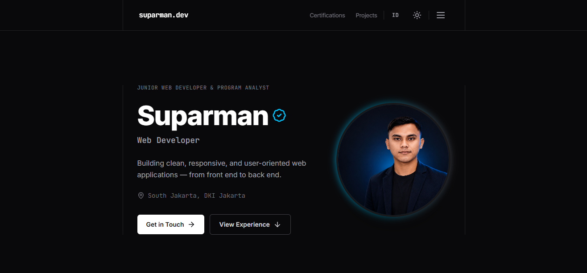

# Suparman - Portfolio Website

A modern, responsive portfolio website showcasing my journey as a Web Developer. Built with React, Tailwind CSS, and Framer Motion for smooth animations and elegant design.



## Features

- Modern Design: Clean, professional UI with dark/light mode support
- Responsive Layout: Optimized for all devices (mobile, tablet, desktop)
- Smooth Animations: Elegant transitions using Framer Motion
- Bilingual Support: Available in Indonesian and English (i18n)
- SEO Optimized: Meta tags, Open Graph, and JSON-LD structured data
- Accessibility: WCAG compliant with keyboard navigation and screen reader support
- Performance: Fast loading with optimized assets and code splitting

## Tech Stack

- Frontend Framework: React 18
- Styling: Tailwind CSS
- Animation: Framer Motion
- Build Tool: Vite
- Internationalization: i18next
- Icons: Lucide React
- Testing: Vitest + React Testing Library

## Installation

Clone the repository:
```bash
git clone https://github.com/minzdev/portfolio-website.git
cd portfolio-website
```

Install dependencies:
```bash
npm install
```

Run development server:
```bash
npm run dev
```

Open [http://localhost:5173](http://localhost:5173) in your browser.

## Build & Deploy

Build for production:
```bash
npm run build
```

Preview production build:
```bash
npm run preview
```

Run tests:
```bash
npm test
```

## Project Structure

```
portfolio-website/
├── public/              # Static assets
│   ├── profile.png      # Profile photo
│   ├── favicon.svg      # Favicon
│   └── og-image.png     # Open Graph image
├── src/
│   ├── components/      # Reusable UI components
│   ├── sections/        # Page sections (Hero, About, Experience, etc.)
│   ├── pages/           # Page components
│   ├── hooks/           # Custom React hooks
│   ├── lib/             # Utility functions
│   ├── data/            # CV data (ID & EN)
│   ├── i18n/            # Internationalization config
│   └── main.jsx         # App entry point
├── index.html           # HTML template
├── vite.config.js       # Vite configuration
└── tailwind.config.js   # Tailwind CSS configuration
```

## Customization

### Update Personal Information

Edit the CV data files:
- `src/data/cv.js` (Indonesian)
- `src/data/cv.en.js` (English)

### Change Colors

Modify theme colors in `tailwind.config.js`:
```javascript
theme: {
  extend: {
    colors: {
      brand: '#06b6d4', // Your brand color
    },
  },
}
```

### Add New Projects

Add project objects to the `projects` array in `src/data/cv.js`:
```javascript
{
  slug: 'project-slug',
  name: 'Project Name',
  description: 'Project description',
  year: '2024',
  tech: ['React', 'Node.js', 'Tailwind CSS'],
  liveUrl: 'https://example.com',
  images: '/project-image.png',
  // ... other fields
}
```

## Sections

- Hero: Introduction with profile photo and CTA buttons
- About: Professional summary and background
- Experience: Work experience timeline
- Skills: Technical skills grouped by category
- Education: Academic background
- Certifications: Professional certifications and training
- Projects: Portfolio of featured projects
- GitHub Activity: GitHub contribution stats
- Contact: Contact information and social links

## License

This project is open source and available under the [MIT License](LICENSE).

## Author

**Suparman**
- Website: [suparman.dev](https://suparman.dev)
- GitHub: [@minzdev](https://github.com/minzdev)
- LinkedIn: [suparman0921](https://www.linkedin.com/in/suparman0921/)
- Email: suparman0921@gmail.com

## Acknowledgments

- Design inspiration from modern portfolio websites
- Icons by [Lucide](https://lucide.dev/)
- Fonts by [Google Fonts](https://fonts.google.com/) (Inter & JetBrains Mono)
